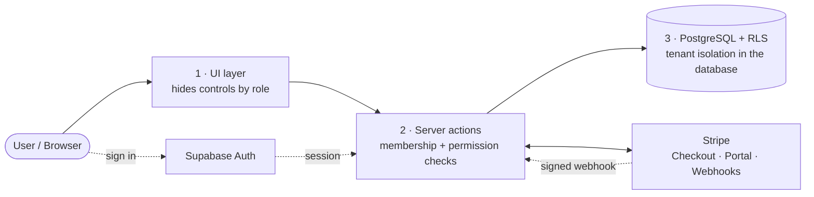

# AgencyOS

**A production-style, multi-tenant SaaS starter for agencies — clients, projects, tasks, teams, roles, and billing, with database-enforced tenant isolation.**

🌐 **Live demo:** [agency-os-ten-alpha.vercel.app](https://agency-os-ten-alpha.vercel.app)


---

## What it is

AgencyOS is a complete multi-tenant SaaS foundation: organizations sign up, invite their team, and manage **clients → projects → tasks** in an isolated workspace. It demonstrates the parts that are genuinely hard to get right in a real SaaS — **tenant data isolation, role-based access control, and subscription billing** — using patterns you'd ship to production.

The headline feature is **security**: no organization can ever see another's data, and that guarantee is enforced at the **database** level with PostgreSQL Row-Level Security — not just in application code that could be bypassed.

## 🔑 Live demo & credentials

Try it at **[agency-os-ten-alpha.vercel.app](https://agency-os-ten-alpha.vercel.app)**. Four accounts are pre-seeded in the **Acme Studio** demo organization, one per role — log in as each to see how the UI and permissions change:

| Role | Email | Password | Can do |
|---|---|---|---|
| **Owner** | `demo-owner@agencyos.dev` | `DemoPass123!` | Everything, incl. billing & settings |
| **Admin** | `demo-admin@agencyos.dev` | `DemoPass123!` | Manage data, members & audit logs |
| **Member** | `demo-member@agencyos.dev` | `DemoPass123!` | Create/edit clients, projects, tasks |
| **Viewer** | `demo-viewer@agencyos.dev` | `DemoPass123!` | Read-only |

> Billing runs in **Stripe test mode** — upgrade with card `4242 4242 4242 4242`, any future expiry, any CVC.

## 🏗️ How it works

Every request passes through **three independent authorization layers** — a flaw in any one is caught by the next — with tenant isolation ultimately guaranteed by the database, not just application code:



> 👀 **See it running:** the [live demo](https://agency-os-ten-alpha.vercel.app) is seeded with data — sign in with any role from the table above to explore the actual app.

## ✨ Features

- **Authentication** — email/password auth via Supabase; protected routes with a proxy guard
- **Multi-tenancy** — organizations with slug-based workspaces; a user can belong to many orgs
- **RBAC** — four roles (Owner / Admin / Member / Viewer) enforced in the UI, in server actions, and in the database
- **Clients → Projects → Tasks** — full CRUD with status filters, assignees, and empty/loading states
- **Team invites** — one-time, hashed invite links with expiry and email-match enforcement
- **Audit log** — every important mutation is recorded and attributed to an actor
- **Billing** — Stripe Checkout, Customer Portal, and signature-verified webhooks (Free / Pro / Business)
- **Plan limits** — server-enforced caps on clients/projects/members by plan
- **Dashboard** — overview cards + a responsive sidebar layout

## 🧱 Tech stack

| Layer | Choice |
|---|---|
| Framework | **Next.js 16** (App Router, Server Actions, Route Handlers) |
| Language | **TypeScript** |
| UI | **React 19**, **Tailwind CSS v4**, Base UI / shadcn-style components, lucide-react icons |
| Auth & DB | **Supabase** — Postgres + Auth + **Row-Level Security** |
| Payments | **Stripe** (Checkout, Portal, Webhooks) |
| Hosting | **Vercel** (auto-deploy on push to `main`) |

## 🛡️ Architecture & security model

Tenant isolation is defended in **three layers**, so a bug or bypass in one is caught by the next:

1. **UI** — components hide actions a role can't perform (a Viewer never sees "New" or "Delete").
2. **Server** — every Server Action re-checks org membership and permission via a central matrix (`lib/permissions.ts`) before touching data. The client is never trusted.
3. **Database (the backstop)** — **PostgreSQL RLS** policies gate every tenant table by `organization_id`. Even a leaked token or a direct API call can only ever read/write rows for orgs the user actually belongs to.

Supporting decisions:

- **RLS helper functions** — `SECURITY DEFINER` functions (`is_org_member`, `get_org_role`, `shares_org`) keep policies fast and free of recursion.
- **Least-privilege clients** — a public **anon** client (browser/server, always subject to RLS) is the default; a **service-role admin** client is used only for narrow privileged server operations (writing audit logs, accepting an invite, handling Stripe webhooks) and is **never** shipped to the browser.
- **Invites** — only a **SHA-256 hash** of each token is stored; the raw token lives solely in the emailed link. Invites expire (7 days) and require the accepting account's email to match.
- **Billing integrity** — Stripe **webhook signatures are verified** against the raw request body, and subscription state is written from Stripe events (Stripe is the source of truth), never trusted from the client.

## 📁 Project structure

```
agency-os/
├─ db/
│  ├─ migrations/            # SQL run in the Supabase SQL Editor, in order
│  │  ├─ 001_initial_schema.sql        # tables + RLS policies
│  │  ├─ 002_grants.sql                # table GRANTs
│  │  ├─ 003_create_organization_fn.sql# atomic org+owner creation (SECURITY DEFINER)
│  │  └─ 004_profiles_email_and_privacy.sql
│  └─ seed.mjs              # idempotent demo data + demo accounts
├─ docs/
│  └─ testing-checklist.md  # manual QA + security pass
├─ src/
│  ├─ app/
│  │  ├─ (auth)/            # login / signup
│  │  ├─ (dashboard)/dashboard/[orgSlug]/   # clients, projects, tasks,
│  │  │                                     # members, audit-logs, billing, settings
│  │  ├─ invite/[token]/    # invite acceptance
│  │  ├─ api/stripe/webhook # Stripe webhook handler
│  │  └─ onboarding/        # first-org creation
│  ├─ lib/                  # auth, permissions, audit, invites, plans, limits, stripe, supabase clients
│  └─ components/           # UI + dashboard chrome
└─ proxy.ts                 # route protection (Next.js 16 proxy)
```

## 🚀 Getting started (local)

**Prerequisites:** Node 20+, a [Supabase](https://supabase.com) project, and a [Stripe](https://stripe.com) account (test mode).

```bash
# 1. Install
npm install

# 2. Configure environment
cp .env.example .env.local
#    then fill in your Supabase + Stripe values (see below)

# 3. Set up the database
#    In the Supabase SQL Editor, run each file in db/migrations/ in order (001 → 004)

# 4. Seed demo data + accounts
node db/seed.mjs

# 5. Run
npm run dev          # http://localhost:3000
```

### Environment variables (`.env.local`)

| Variable | Purpose |
|---|---|
| `NEXT_PUBLIC_SUPABASE_URL` | Supabase project URL |
| `NEXT_PUBLIC_SUPABASE_ANON_KEY` | Supabase anon (publishable) key |
| `SUPABASE_SERVICE_ROLE_KEY` | Service-role key (server only — bypasses RLS) |
| `STRIPE_SECRET_KEY` | Stripe secret key |
| `STRIPE_WEBHOOK_SECRET` | Signing secret for the webhook endpoint |
| `STRIPE_PRO_PRICE_ID` / `STRIPE_BUSINESS_PRICE_ID` | Price IDs for paid plans |
| `NEXT_PUBLIC_STRIPE_PUBLISHABLE_KEY` | Stripe publishable key |
| `NEXT_PUBLIC_APP_URL` | App base URL (e.g. `http://localhost:3000`) |

### Testing Stripe webhooks locally

```bash
stripe listen --forward-to localhost:3000/api/stripe/webhook
# put the printed whsec_… into STRIPE_WEBHOOK_SECRET
```

## ☁️ Deployment (Vercel)

1. Import the repo into Vercel (framework auto-detected; root directory `./`).
2. Add all environment variables above, setting `NEXT_PUBLIC_APP_URL` to your deployed URL.
3. In the **Stripe Dashboard**, create a webhook endpoint at `https://<your-domain>/api/stripe/webhook` listening for `checkout.session.completed` and `customer.subscription.created|updated|deleted`, and put its signing secret in `STRIPE_WEBHOOK_SECRET`.
4. Deploy. Every push to `main` auto-deploys.

## ✅ Quality

- `docs/testing-checklist.md` documents a full manual QA + security pass (auth, RBAC per role, tenant isolation verified at the DB level, invites, billing, plan limits).
- Clean `next build`, zero TypeScript errors, ESLint clean.
- No secrets in the repo — only `.env.example` (placeholders) is tracked.

---

_Built as a portfolio project to demonstrate production multi-tenant SaaS patterns._
